  

       

<h3 align="center"><a href="https://fgilde.github.io/">🚀 &nbsp;All my live demos in one place → fgilde.github.io</a></h3>

---

## 👋 &nbsp;Hi, I'm Florian — aka Mandaflorian

<table>
<tr>
<td width="50%" valign="top">

**About**

- 🧑‍💻 &nbsp;Developer, mostly **.NET / Blazor** — plus a lot of TypeScript
- 🧩 &nbsp;Maintainer of **[MudBlazor.Extensions](https://www.mudex.org)** and friends
- 🎛️ &nbsp;I like building tools: audio, video, editors, playgrounds
- 🤿 &nbsp;Husband, father, diver, skateboarder
- 🌍 &nbsp;More about me → **[florian.gilde.org](https://florian.gilde.org)**

</td>
<td width="50%" valign="top">

**Currently**

- 🔭 &nbsp;Building **[videola](https://videola.app)** — a full web video editor
- 🧠 &nbsp;Playing with local AI: **[AI-Ming](https://poweraim.de)**, **[MuseForge](https://github.com/fgilde/MuseForge)**
- ☁️ &nbsp;.NET **Aspire** tooling → **[AspireUI](https://github.com/fgilde/AspireUI)**, **[aspire.love](https://www.aspire.love)**
- 👯 &nbsp;Open for collaborations with devs & content creators
- 📫 &nbsp;Reach me via **[gilde.org](https://www.gilde.org)**

</td>
</tr>
</table>

---

## 🧰 &nbsp;Stack

 

        

---

## 🚀 &nbsp;Live Demos & Docs

> Every repo below ships a real, clickable page. Cards, live previews and search for all of them:
> **[fgilde.github.io](https://fgilde.github.io/)**

| Project | What it is | Live | Code |
|---|---|:--:|:--:|
| **MudBlazor.Extensions** | Dialogs, components & services on top of MudBlazor | [mudex.org](https://www.mudex.org) | [↗](https://github.com/fgilde/MudBlazor.Extensions) |
| **videola** | Web video editor: multi-track, effects, keyframes, audio studio | [videola.app](https://videola.app) | [↗](https://github.com/fgilde/videola) |
| **AI-Ming** | Local AI companion | [poweraim.de](https://poweraim.de) | [↗](https://github.com/fgilde/AI-Ming) |
| **Audiola** | WPF audio editor | [audiola.de](https://audiola.de) | [↗](https://github.com/fgilde/Audiola) |
| **blobbyVolley** | 3D Blobby Volley clone, Three.js + WebRTC multiplayer | [play](https://fgilde.github.io/blobbyVolley/) | [↗](https://github.com/fgilde/blobbyVolley) |
| **CheckoutAndBuild** | Local one-click CI as a Visual Studio extension | [docs](https://fgilde.github.io/CheckoutAndBuild/) | [↗](https://github.com/fgilde/CheckoutAndBuild) |
| **AspireUI** | UI layer for .NET Aspire | [demo](https://fgilde.github.io/AspireUI/) | [↗](https://github.com/fgilde/AspireUI) |
| **Nextended** | Utility library (formerly nExt) | [docs](https://fgilde.github.io/Nextended/) | [↗](https://github.com/fgilde/Nextended) |
| **UNLowCoder** | Low-code tooling | [docs](https://fgilde.github.io/UNLowCoder/) | [↗](https://github.com/fgilde/UNLowCoder) |
| **MuseForge** | Music generation playground | [demo](https://fgilde.github.io/MuseForge/) | [↗](https://github.com/fgilde/MuseForge) |
| **PowerClean** | Cleanup utility | [page](https://fgilde.github.io/PowerClean/) | [↗](https://github.com/fgilde/PowerClean) |
| **DrunkenRecords** | Side project page | [page](https://fgilde.github.io/DrunkenRecords/) | [↗](https://github.com/fgilde/DrunkenRecords) |

---

## ⭐ &nbsp;Featured Repos

 

 

 

   

---

## 📊 &nbsp;Stats

 

### 🐍 &nbsp;My contributions, eaten by a snake

<picture><source media="(prefers-color-scheme: dark)" srcset="https://raw.githubusercontent.com/fgilde/fgilde/output/github-snake-dark.svg"><source media="(prefers-color-scheme: light)" srcset="https://raw.githubusercontent.com/fgilde/fgilde/output/github-snake.svg"></picture>

---

## 📺 &nbsp;Latest YouTube Videos

<!-- YOUTUBE:START -->
- [AmbiWall Jurassic world](https://www.youtube.com/watch?v=2W2ROT-ArfM)
- [AmbiWall Music visualizer](https://www.youtube.com/watch?v=ozc5UuKM-zg)
- [AmbiWall Music visualizer](https://www.youtube.com/watch?v=DuZW2VFWxQs)
- [AmbiWall Music visualizer](https://www.youtube.com/watch?v=Y6_CdDy4R8c)
- [AmbiWall Sample Fifa effect](https://www.youtube.com/watch?v=jiHj_XcoRrk)
- [AmbiWall Sample 2](https://www.youtube.com/watch?v=JhQFlL-AuIA)
- [AmbiWall Sample 1](https://www.youtube.com/watch?v=Xo5VpuMKPO4)
<!-- YOUTUBE:END -->

➡️ &nbsp;[more videos …][youtube]

## 📕 &nbsp;Latest Blog Posts

<!-- BLOG-POST-LIST:START -->
- [Test](https://dev.to/fgilde/test-20b9)
<!-- BLOG-POST-LIST:END -->

➡️ &nbsp;[dev.to/fgilde][devto]

---

### 🤝 &nbsp;Connect

 &nbsp;  &nbsp;  &nbsp;  &nbsp;  &nbsp;  &nbsp;  &nbsp;  &nbsp;  &nbsp; 

<i><a href="https://fgilde.github.io/">fgilde.github.io</a> · <a href="https://www.gilde.org">gilde.org</a> · <a href="https://florian.gilde.org">florian.gilde.org</a></i>

[youtube]: https://www.youtube.com/channel/UCXT5-iCTs2GZVINjJsVZjQw
[devto]: https://dev.to/fgilde
